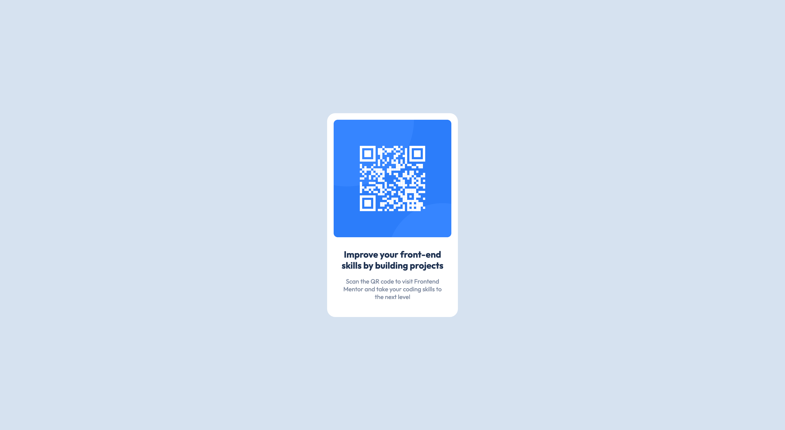

# QR code component

## Table of contents

- [Overview](#overview)
  - [Screenshot](#screenshot)
  - [Links](#links)
- [My process](#my-process)
  - [Built with](#built-with)

**Note: Delete this note and update the table of contents based on what sections you keep.**

## Overview

Simple demo project to get used to [frontendmentor.io](https://www.frontendmentor.io/)

### Screenshot

### Links

- [Project code](https://github.com/superpooperxxx/qr-code)
- [DEMO](https://superpooperxxx.github.io/qr-code/)

## My process

### Built with

- Semantic HTML5 markup
- [SASS](https://sass-lang.com/)
- Flexbox
